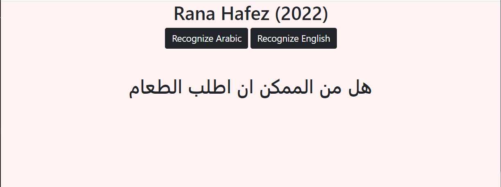
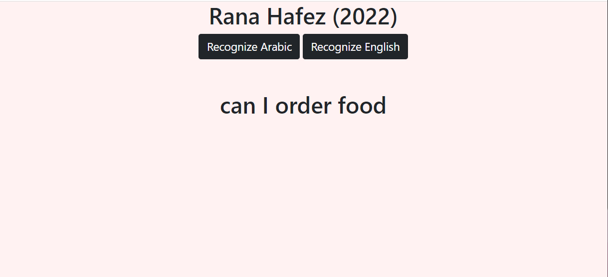

# Recognize What I Say.
## Access From Here http://192.168.1.32:5000 
## Smartest Methods First Assignment

### This is a Flask Web App that recognizes speach in 2 different languages. Ar and En.

#### usage
* it is used to recognize voices in different languages.
* Once the user stops talking the text will appear onto the screen.

#### Libraries 
* it uses Flask frame.
* speech recognition library and recognize google API.

#### Inspiration
* https://s-m.com.sa/r2/test/
#### UI for arabic

#### UI for English

# Algorithm For Making the ESP32 Work.

1) Download a programming environment example Arduino IDE 
2) Click file menu on the top menu bar <u> In Arduino IDE </u>
3) Go to preferences and in the setting tab,  Look for (additional boards manager urls) .
4) Add the link https://raw.githubusercontent.com/espressif/arduino-esp32/gh-pages/package_esp32_index.json to the box. Click ok to save the setting.
5) Next <u> In Arduino IDE </u>  Click on tools go to the (board: Arduino/Genuino Uno) then to Boards Manager.
6) Search for esp32 in the search box and press install. 
7) plug The board ESP32 to your computer. 
8) <u> In Arduino IDE </u> From tools Go to Board then Choose the name of the board (Wasdom ESP32). 
9) <u> In Arduino IDE </u> From tools Go to port and Select COM (communication port). 
10) Press the upload button for it to start the compiler. 
11) In your board:
     * Hold down the boot button in your ESP32 board. 
     * After connecting or when you see upload progressing, Release the finger. 
     * now you can see “done uploading” message.
12) Press the ENABLE button to restart and run the sketch (additional for some boards).

# Rana Hafez (2022)